# Clothing Fit Prediction in E-Commerce: Analyzing the Rent the Runway
Data

**1. Introduction**

Proper fit in clothing is essential for people's overall satisfaction
with the clothing. Despite standardized sizing labels, individual body
measurements vary, leading to diverse fit levels. To enhance the user's
overall satisfaction with the clothing purchase experience, we attempted
to develop a classification algorithm in which the fitting size
corresponds to the user's body measurements.

**1.1 Dataset**

In this project, we utilized the RentTheRunway clothing fit database.
This dataset consists of ratings, review summary, review text, review
date, fit feedback, user/item interactions, clothing category
information, and user measurements: bust size, weight, body type,
height, size, age, and purpose of purchase.

**1.2 Exploratory Data Analysis**

To gain insight into the significance of each feature, we sought to
accurately visualize and statistically summarize the relationships
between various categorical variables. We first examined and visualized
all the different distributions of fit and rating amongst the various
features.

The rating scores represent customer satisfaction with the item. The
fundamental assumption is that satisfaction tends to be higher when the
clothing item fits the user well.

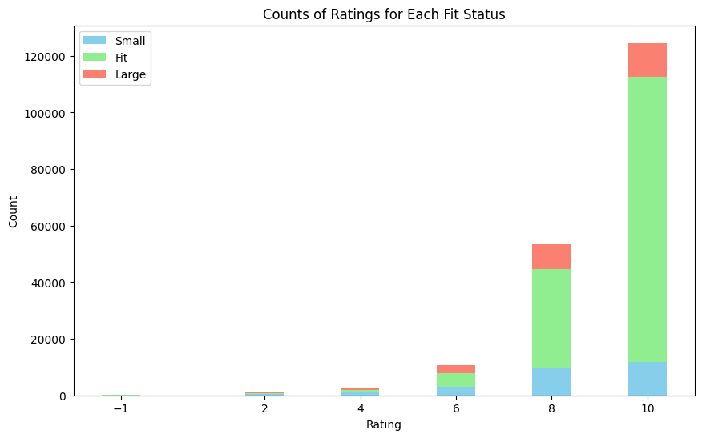{width="3.4302012248468943in"
height="2.153847331583552in"}


Figure 1.1.1

*\* This stacked bar graph depicts the count of ratings for each fit,
where -1 means there was no rating given for that specific review.*

The bar graph \"Counts of Ratings for Each Fit Status\" reveals that, as
the user groups giving higher ratings tend to be, a higher proportion of
users reported the product\'s fit. This indicates that the assumption of
customers being more satisfied when the product is in \"fit\" status was
indeed correct.

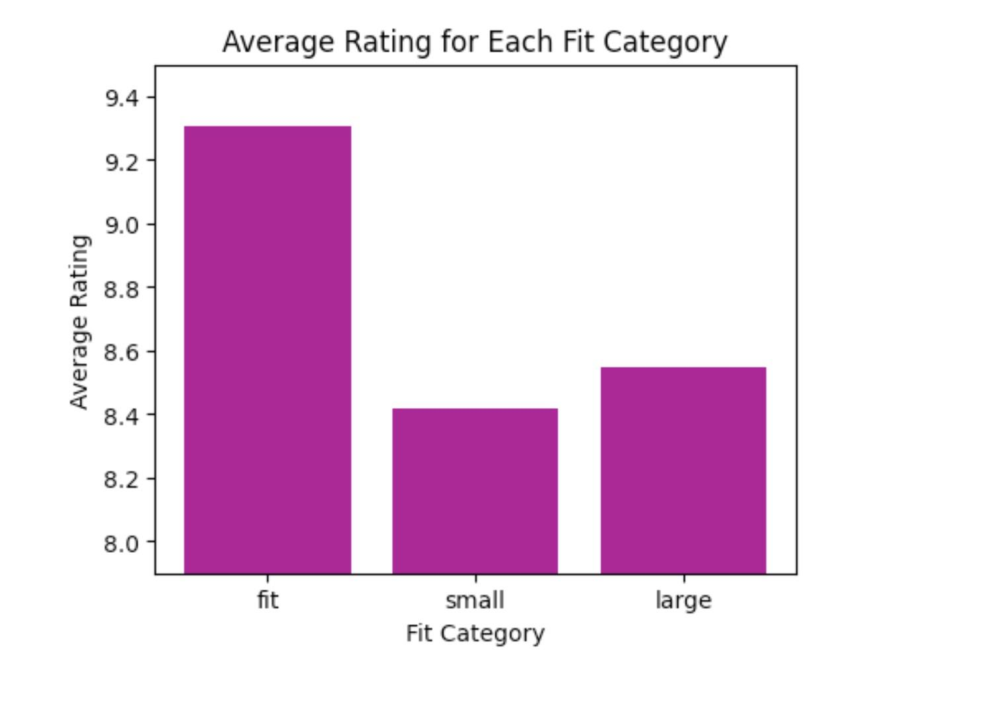{width="3.0in" height="2.125in"}

Figure 1.1.2

According to \"Average Ratings for Each Fit Category\" (Figure 1.1.2),
users who reported having a proper fit tend to give approximately 10%
higher ratings compared to users reporting large or small fits. This
indicates that the assumption of customers being more satisfied when the
product is in \"fit\" status was indeed correct.

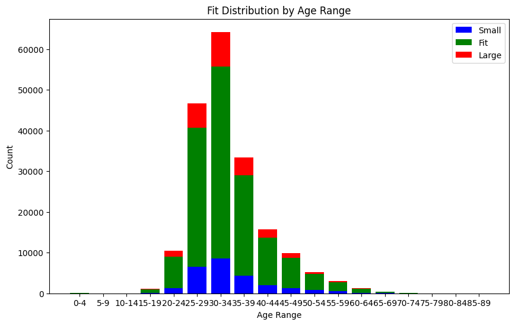{width="3.0in" height="1.8888888888888888in"}

Figure 1.2

*Stacked bar chart of the number of items in each age range and their
fit status. Red indicates fit is large, green indicates that the fit is
fit, and blue indicates the fit is small.*

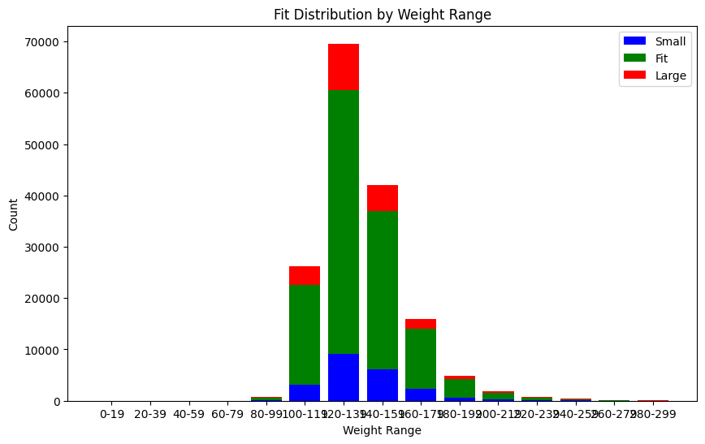{width="3.0in" height="1.8888888888888888in"}

Figure 1.3

*Stacked bar chart of the number of items in each weight range and their
fit status. Red indicates fit is large, green indicates that the fit is
fit, and blue indicates the item is small.*

In the assumption that the rating and fit of an item for an individual
would correlate with that of their body measurements and their clothing
size, we posited that the compatibility of an item's fit would be
proportional to the product of bust size, weight, and height divided by
the clothing size. To investigate this, we created scatter plots
comparing bust size, weight, and height against the clothing size
(Figures 1.4, 1.5, and 1.6, respectively), and scatter plots of the
product of weight, bust size, and height against size (Figure 1.6). In
these plots, red circles indicate a good fit, blue circles signify items
that fit small, and black triangles represent items that fit large.

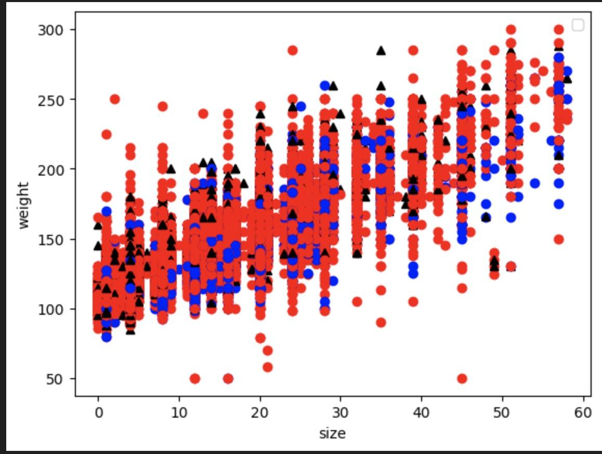{width="2.6302088801399823in"
height="1.9237478127734033in"}

Figure 1.4

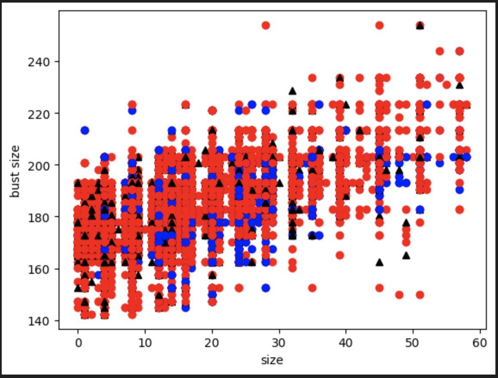{width="2.8958333333333335in"
height="2.1770833333333335in"}

Figure 1.5

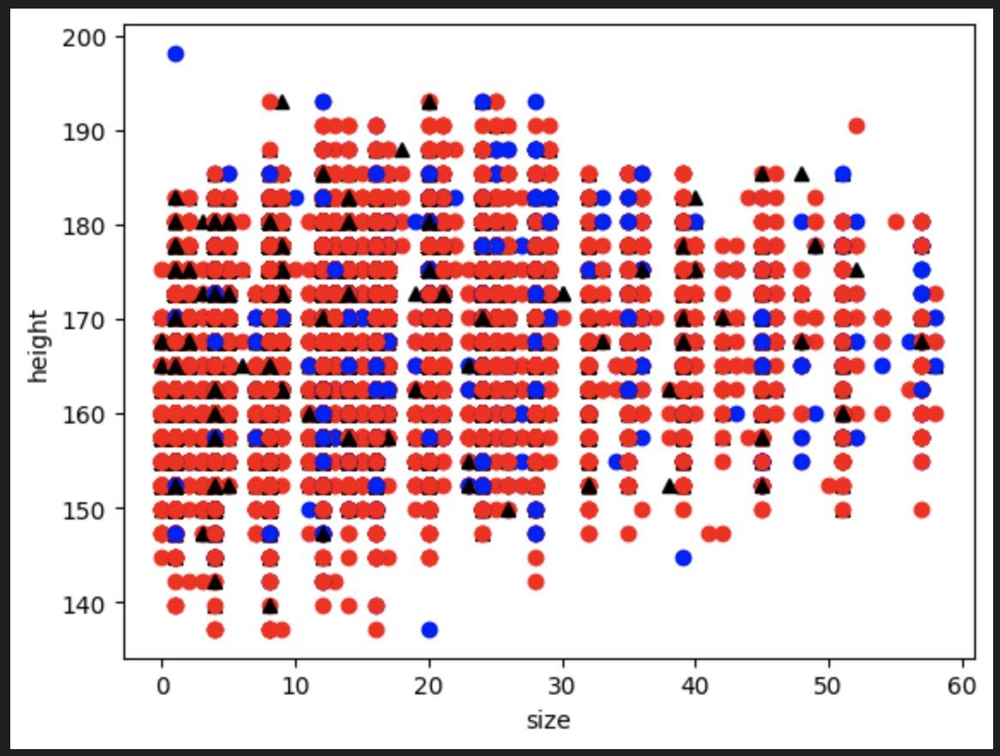{width="2.8958333333333335in"
height="2.154222440944882in"}

Figure 1.6

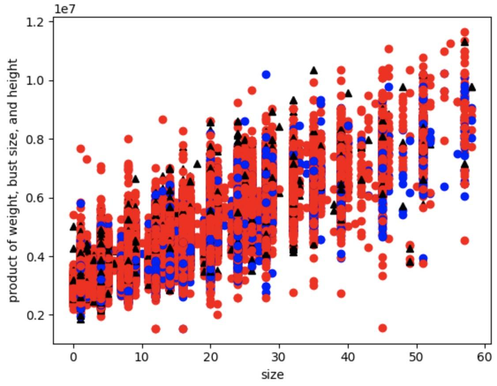{width="3.0in" height="2.3333333333333335in"}

Figure 1.7

The data points for the three fit classes (fit, small, large) are widely
dispersed across each spectrum. In the weight against size graph, items
with a size 20 that fit well ranged from a weight of 60 lbs to 270 lbs,
while those that fit small ranged from 100 lbs to 240 lbs, and those
that fit large ranged from 110 lbs to 240 lbs. This distribution
suggests a lack of variance, and the plots did not allow us to draw a
soft margin boundary to separate the three classes. With a lack of
distinct patterns, consequently, we concluded that there are no apparent
relationships between weight, bust size, and the fit of an item.

We also plotted several histograms to display the fit amongst
categories, where we noticed significant differences amongst categories
(Figure 1.8.1, 1.8.2, 1.8.3). An interesting fact we noticed was that
some categories always fit well, while some categories never fit either
too small or too large (one or the other).

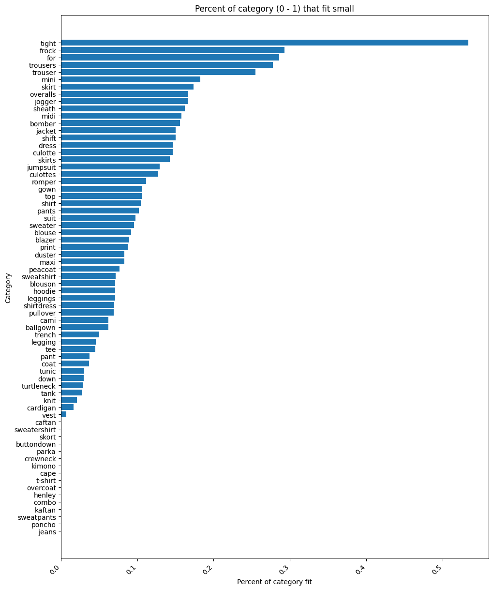{width="2.847384076990376in"
height="3.401042213473316in"}

Figure 1.8.1

*Horizontal Bar Chart depicting the percentage (from 0 to 1) of each
"category" of clothes that fit small. (fit status is "small")*

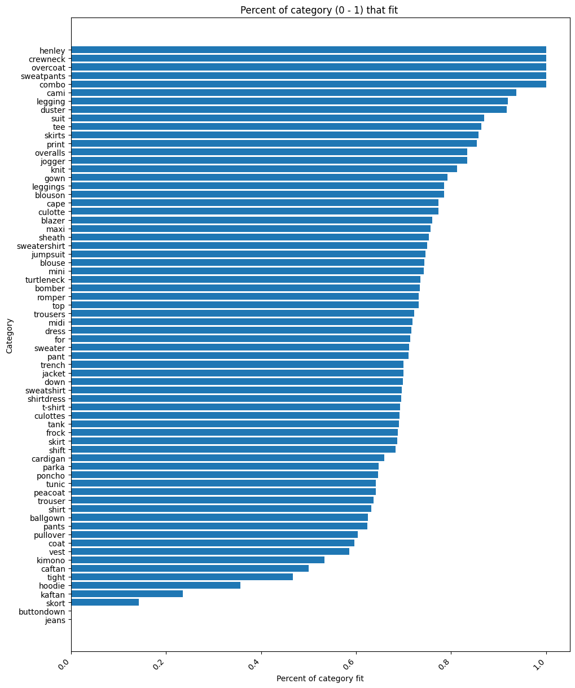{width="2.787130358705162in"
height="3.338542213473316in"}

Figure 1.8.2

*Horizontal Bar Chart depicting the percentage (from 0 to 1) of each
"category" of clothes that fit well. (fit status is "fit")*

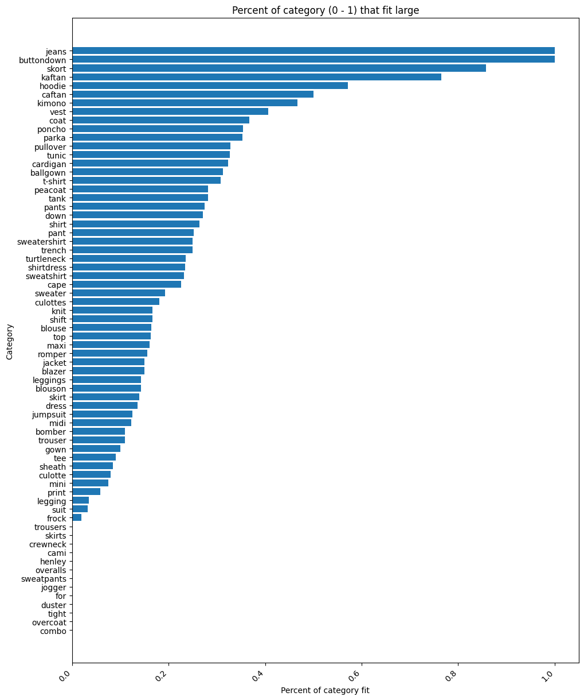{width="2.776984908136483in"
height="3.3169542869641293in"}

Figure 1.8.3

*Horizontal Bar Chart depicting the percentage (from 0 to 1) of each
"category" of clothes that fit large. (fit status is "large")*

We plotted a graph that counts the number of small, large, and fit as
shown in Figure 1.1.1.

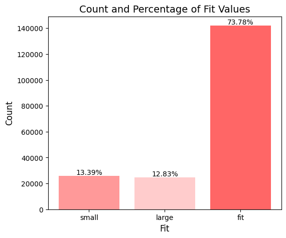{width="3.0in" height="2.5in"}

Figure 1.12

*Depicted in the figure above is the count and percentage of fit
values(small, large, and fit), where count is the y-axis and total
percentages are labeled on the graph.*

According to Figure 1.12, we concluded that there's a class imbalance
issue of fit in our dataset.

To analyze fit classes (fit, small, large), we quantified each class by
counting the instances for every feature. Through tracking the
occurrences of 'small', 'fit', and 'large' across each feature, to
better understand their distribution.

We analyzed the distribution of instances across the 7 unique body types
in the "body types" column. For each body type, we determined the count
of items that fit well, fit small, and fit large. Then we calculated the
total number of instances for each body type. To quantify the fit for a
particular category within a body type, we computed the ratio of the
count of fitting instances for that category to the total instances for
that body type (count\[fit\]\[category\] / count\[body type\]).
Subsequently, we calculate the variance of different fit classes (small,
fit, large) across the seven body types. Finally, we then compute the
average variance across the three fit classes and present the resulting
values in Table 1.0.

**Table 1.0**

  -----------------------------------------------------------------------
  columns                             Variance to fit
  ----------------------------------- -----------------------------------
  Category                            0.032335110592144944

  Rating                              0.025825445598840122

  User ID                             0.10945698757858863

  Weight                              0.02036486552654149

  Body Type                           0.000104171686862020788

  Size                                0.009347667197948526

  Age                                 0.016891512443223594

  Item ID                             0.04918481229179359

  Review Date                         0.012939475743796345

  Rent For                            0.004762054476467751
  -----------------------------------------------------------------------

**2. Predictive Task**

The EDA revealed that the rating of a transaction exhibited less
significance compared to the fit status in terms of predictive
potential. Figure 1.1.1 illustrates this point, as it depicts how skewed
the majority of ratings are as they cluster around 8 and 10. The vast
majority of ratings were positive, with an average rating of 9.09. With
a lack of variability, we did not believe using rating as a basis of our
predictive model would lend itself to an informative predictive task.
Instead, we arrived at predicting the fit of an item for a given user.

The concept of "fit" seems much more pertinent and practical from a
merchant and consumer perspective in predicting the satisfaction of a
specific purchase. This addresses a very practical problem of the
clothing retail sector and the needs of the customer. Therefore, to
create a better tool, we have focused on designing a model that could
predict whether an item will fit a customer.

**2.1 Model evaluation**

We are going to evaluate our model using precision, recall, accuracy,
and F1-score. Our main objective is to optimize the F1-scores suggested
by Vignesh Gokul - Teaching Assistance of CSE 158 - since F1 scores take
both the precision and recall into account and accuracy is biased for
unbalanced data as shown in Figure 1.1.2.

**2.2 Two Baseline Model**

-   Always predicting the most popular class (fit class)

-   Naive-Bayes model.

**2.3 Other Models**

-   Logistic Regression

```{=html}
<!-- -->
```
-   Support Vector Machine.

-   Random Forest

-   Decision Trees Model

**2.4 Pre-process**

In addressing the null values in the dataset, we opted to include only
rows with complete reviews with nonnull values within the specific
categories that we are using. Unexpectedly, there are no null values for
the features that were selected as depicted in the feature selection
section 2.2.

To preprocess the raw data to a convenient format for extracting various
information we undertook the conversion of data into numeric data types.
All scientific units for categories of measurements were removed and all
possible string data types were converted to int data types so that the
algorithm for analysis could be directly applied. Additionally, we
converted the date stamp into UNIX time in seconds to make the time data
continuous when plotting and easier to manipulate and perform arithmetic
operations. Categorical data were converted into binary vectors by
modified one-hot encoding[^1] to ensure the numerical representation of
categories.

**2.5 Feature Selection**

In the EDA, we measured the variance and distribution of features in
relation to fit, etc. As Professor Julian McAuley noted, one of the most
important characteristics that impact a classifier model is the variance
of different features with respect to fit status. Hence, we aim to
select features with the greatest variance that contributed to fit.

From Table 1.0, we observed that userID, itemID, and category of items
had the greatest variance. Hence, we came up with three heuristics.

**Heuristic 1:** If the customer has a higher proportion of past
purchases that fit, then they are more likely to purchase a new item
that fits

**Heuristic 2:** If the item tends to fit more customers, then it tends
to be fit for future customers.

**Heuristic 3:** Some categories of the garments may generally fit
better. For example, a jacket tends to fit more often.

In the attempt to find the most significant features, features were
tested one by one starting from the highest variance and progressing to
the lowest (Table 1.0). If adding the feature with the next highest
variance improves the metric, we include it; otherwise, we stop.

Additionally, random combinations of various features were plugged into
the model.

Ultimately, random combinations failed to enhance the F1 score
performance. The optimal results were achieved by systematically
selecting features, starting from the highest variance feature.
Improvement persisted until the inclusion of the next feature with the
highest variance no longer contributed to enhancing the F1 score
performance.

After thorough analysis, we concluded that the optimal features to
select are category, user ID, size, and item ID as they yielded the
highest precision, recall, f1 score, and accuracy.

**3. Model**

**3.1 Model attempt that gave good result but contradicts with the
goal:**

An attempt to enhance our modeling involves the integration of sentiment
analysis. We initially explored sentiment analysis using n-gram word
count vectors with unigrams and bigrams. However, this approach barely
improved over our baseline, regardless of data oversampling.

Next, we tried text-mining with the TF-IDF model, which, while showing
some improvement, still didn\'t meet our expectations. We then attempted
a hybrid strategy, combining word count vectors with our existing
features. Yet, due to the dataset\'s vast array of unique reviews, this
significantly increased our feature vectors\' dimensionality. Despite
close monitoring, sentiment analysis integration failed to enhance our
model across all metrics:

REVIEW TEXT ONLY:\
Stat for decision tree using oversample data Precision:
0.6922003126894484;

Recall: 0.6859408100673475.

f1 = 0.6890563460805489.

Accuracy = 0.7932574659665962

COMBINED:\
Stat for decision tree using oversample data Precision:
0.8099829967623973;

Recall: 0.8946411573522224.

f1 = 0.8502098528992299.

Accuracy = 0.7674403892020473

Although the F1 score improved, the overall accuracy decreased compared
to the model excluding text mining. This suggests that sentiment
analysis might introduce more noise, reducing the model\'s predictive
effectiveness. Ultimately, we concluded that a simpler approach without
sentiment analysis was more robust and accurate for our dataset.

Moreover, sentiment analysis presented a misalignment with our objective
of predicting user-item compatibility pre-rental, aiming to minimize
returns and enhance customer satisfaction. Relying on post-transaction
reviews contradicted this goal, leading us to exclude sentiment analysis
from our model. Future work might explore refining this aspect with new
data.

**3.2 Unsuccessful Attempt Using Original Dataset**

At first, we tried running the original dataset with Logistic
regression, a support vector machine, a random forest, and the baseline
models (Naive Bayes model and model that always predicts the most
popular class).

**Baseline:**

  --------------------------------------------------------------------------------------------------------
  **Model**      **Precision**            **Recall**     **F1**                   **Accuracy**
  -------------- ------------------------ -------------- ------------------------ ------------------------
  **Always       **0.7348158154517587**   **1.0**        **0.8471398622342018**   **0.7348158154517587**
  predict                                                                         
  'fit'**                                                                         

  --------------------------------------------------------------------------------------------------------

**Other models:**

  ------------------------------------------------------------------------------------------------------------------
  **Model**      **Precision**            **Recall**               **F1**                   **Accuracy**
  -------------- ------------------------ ------------------------ ------------------------ ------------------------
  **Logistic     **0.7348158154517587**   **1.0**                  **0.8471398622342018**   **0.7348158154517587**
  regression**                                                                              

  **Random       **0.7606314891196131**   **0.7562751891395036**   **0.7584470838503812**   **0.6460227567932665**
  Forest**                                                                                  

  **Naive        **0.7348158154517587**   **1.0**                  **0.8471398622342018**   **0.7348158154517587**
  Bayes**                                                                                   
  ------------------------------------------------------------------------------------------------------------------

**3.3 Better Attempt Using Oversampling**

Our models initially did not surpass the baseline, primarily due to the
class imbalance identified during our exploratory analysis, where 73.78%
of entries were marked as \"fit.\" To address this and enhance model
accuracy, we followed Professor Julian McAuley\'s recommendation to
employ oversampling. Specifically, we implemented the Synthetic Minority
Oversampling Technique (SMOTE), which generates synthetic data points to
bolster the minority classes. This approach aimed to balance the class
distribution, thereby improving the overall robustness and performance
of our model.

To find the most optimal solution for prediction, we performed feature
selection as we noted in session 2.4, explored a range of models
consisting of logistic regression, Support Vector Machine, Random
Forest, and Decision Tree, and embraced a trial-and-error methodology.

To avoid overfitting we perform 5-fold cross-validation on models, such
as Support Vector Machine and Logistics Regression on the training date
to pick the best regularization term. training data using the
sklearn.model_selection library. 5-fold cross-validation splits the
training set into 5 subsets, and for each subset, we treat it as a
validation set, while the remaining 4 subsets are the training set. We
find the best regularization by trying 10 different Cs and picking the
best one with the highest cross-validation testing accuracy.

**Baseline:**

  ---------------------------------------------------------------------------------------------------------------------
  **Model**      **Precision**             **Recall**                **F1**                    **Accuracy**
  -------------- ------------------------- ------------------------- ------------------------- ------------------------
  **Always       **0.3326655131**          **1.0**                   **0.4992483258165915**    **0.332665513159093**
  predict                                                                                      
  'fit'**                                                                                      

  **Naive        **0.49818313953488375**   **0.18765398302764852**   **0.27261881089679857**   **0.6668791549039249**
  Bayes**                                                                                      
  ---------------------------------------------------------------------------------------------------------------------

**More complex model**

  ---------------------------------------------------------------------------------------------------------------------
  **Model**      **Precision**             **Recall**                **F1**                    **Accuracy**
  -------------- ------------------------- ------------------------- ------------------------- ------------------------
  **Logistic     **0.41359435555997215**   **0.38046354594397297**   **0.39596613072019793**   **0.6145463376134536**
  Regression**                                                                                 

  **Support      **0.4682467335156487**    **0.35153754904644585**   **0.40158444739791**      **0.6514737577026986**
  Vector                                                                                       
  Machine**                                                                                    

  **Random       **0.4682467335156487**    **0.35153754904644585**   **0.40158444739791**      **0.6514737577026986**
  forest**                                                                                     

  **Decision     **0.8040533909117676**    **0.7475590838580163**    **0.7747777567618688**    **0.8554169322769632**
  Tree**                                                                                       
  ---------------------------------------------------------------------------------------------------------------------

**3.4 Final Model using undersampling technique and Decision Tree
model**

The optimal performance was achieved by employing the undersampling
technique from the ClusterCentroids library from
imblearn.under_sampling. The cluster centroids approach improved our
model's effectiveness. After selecting the best sampling technique and
features that we tried, we got the best performance using the Decision
Tree model and tuning the max_depth hyperparameter.

Although other models, such as logistic Regression, Support Vector
Machine, and Random Forest did not perform very well, the Decision Tree
model performed satisfactorily for the metrics (Precision, recall, F1,
and Accuracy) using Cluster Centroids undersampling technique.

**3.5. Strength and Weaknesses of Different Models Being Compared**

**3.5.1 Baseline - Always Predict 'fit' model**

Strength: This model excels in recall, correctly identifying all items
classified as \'fit\'. It\'s useful when ensuring all potential \'fit\'
items are captured.

Weakness: It falls short in precision and accuracy, poorly
differentiating between \'fit\' and other classes, which leads to a high
rate of false positives.

**3.5.2 Naive Bayes**

**Strength:** This model is very simple and intuitive and takes only a
few seconds to converge.

**Weakness:** It is based on the assumption that all features are
conditionally independent. It got the worst recall and F1 scores.

**3.5.3 Logistic regression**

Strength: The logistic regression model is straightforward to implement.

Weakness: Logistic regression is based on the assumption that there is a
linear relationship between the independent variables. If the
relationship between the two variables is nonlinear, then the linear
regression may not perform as well.

**3.5.4 Support Vector Machine (SVM)**

**Strength:** SVMs are effective in high-dimensional spaces, and
suitable for datasets with a wide range of features.

**Weakness:** They have high computational complexity for large datasets
and are sensitive to feature scaling, which can be challenging given the
diverse range of attributes in fashion items.

**3.5.5 Random Forest**

**Strength:** Offers higher accuracy and helps mitigate overfitting,
useful for the diverse and complex nature of fashion datasets.

**Weakness:** It can exhibit bias in imbalanced datasets, such as the
predominance of the \'fit\' category in our data, potentially skewing
the predictions.

**3.5.6 Decision Tree:**

**Strength:** Insensitive to feature scale and can handle both numerical
and categorical data effectively. It showed the highest precision,
recall, F1, and accuracy in our analysis.

**Weakness:** Susceptible to instability due to small data variations
and noise, which can be significant in datasets with diverse customer
reviews and item characteristics.

**4. Analysis of Literature**

**4.1 RentTheRunway Clothing fit dataset**

RentTheRunway is an existing dataset that is frequently used in
Professor [[Julian McAuley]{.underline}](mailto:jmcauley@ucsd.edu)'s
lab. These datasets are commonly used by the Professor [[Julian
McAuley]{.underline}](mailto:jmcauley@ucsd.edu) and his students.

**Dataset origin and usage**

This dataset is introduced in Rishabh Misra's "Decomposing Fit Semantics
for Product Size Recommendation in Metric Spaces" paper. In this paper,
Misra used it to predict the fit using a different way to handle class
imbalance issues in the dataset using fit semantics.

The problem is to utilize existing datasets to predict how well a
particular item should fit given prior user interactions/transactions
and user information.

There is other research attempting to solve the problem of knowing
whether or not a clothing item will fit before buying it online. This
problem is common in retail, in general, where businesses and consumers
have a vested interest in saving time and money while improving
satisfaction.

**4.2 Similar Datasets and their Studies**

A similar dataset is the Amazon shoe dataset. It was used by Vivek
Sembium who used this dataset for his "Recommending Product Sizes to
Customer" paper. Vivek used this dataset to predict if Amazon's
customers would fit the shoes using a loss function of

$f_{w}(s_{i},\ t_{j})\  = \ w\  \cdot (s_{i}\  - \ t_{j})\ \ $

Another similar dataset being studied is the ModCloth dataset that was
also used in the paper of Rishabh Misra's "Decomposing Fit Semantics for
Product Size Recommendation in Metric Spaces" paper. Misra extracted the
dresses, tops, and bottoms columns from this dataset to run her machine
learning model on.

Our dataset falls under the categories of fashion retail, consumer-item
review, and e-commerce. Other fashion retail datasets, specifically
those within the e-commerce space, have historically been utilized to
study consumer purchase behavior and build recommender systems.

More specifically, these datasets are quite useful in understanding and
predicting an item that a user may like for whatever variety of reasons.
The preferences of customers are studied and used to help optimize the
experience, inventory, and profitability of a business or product.

**4.3 State-of-the-art Methodology**

Most of the methods that we employed or attempted are those that would
be considered state-of-the-art methodologies-- those that are commonly
used in the industry and taught in advanced Machine Learning courses
like CSE 158. Standard practices for datasets like ours typically
involve machine learning algorithms such as Random Forests, Logistic
Regression, SVMs, and Decision Trees, known for their effectiveness in
basic categorization tasks.

However, for recommender systems, the trend shifts towards techniques
like collaborative filtering, content-based filtering, and advanced
methods like neural collaborative filtering and natural language
processing for sentiment analysis. The integration of sentiment
analysis, in particular, is gaining traction.

Additionally, the essence of modern methods lies in the hybridization of
these techniques, blending several approaches to achieve more nuanced
and effective solutions by leveraging their combined efforts.

**4.4 Other Conclusions and Findings**

Between similar datasets describing reviews for user-item transactions
pertaining to the fashion retail industry, results will vary. The nature
of this data is not only subjective to the tastes and tendencies of
users, but it is also dependent upon the brand,

We, however, have found that they are relatively similar to our
findings.

**5. Results and Conclusion**

**5.1 Model Performance and Significance**

Compared to alternatives, our model performed, our model performed
relatively well. The decision tree model as shown in the table has very
good performance which beats all the other models in precision, recall,
F1, and accuracy. The results are very significant because it shows that
not only did the accuracy or the quality of the positive predictions
class be good but also the quantity of the positive predictive class was
good. Meanwhile, it got a very high accuracy of 85.5% for unseen test
data.

**Baseline:**

  ----------------------------------------------------------------------------------------------
  Model          Precision             Recall         F1                   Accuracy
  -------------- --------------------- -------------- -------------------- ---------------------
  Always predict 0.33253400143163925   1.0            0.4991002121887675   0.33253400143163925
  'fit'                                                                    

  Naive Bayes    0.7348158154517587    1.0            0.8471398622342018   0.7348158154517587
  ----------------------------------------------------------------------------------------------

**More complex models**

  --------------------------------------------------------------------------------------------------------------------
  Model            Precision                Recall                   F1                       Accuracy
  ---------------- ------------------------ ------------------------ ------------------------ ------------------------
  Logistic         0.41359435555997215      0.37977917693220187      0.39596613072019793      0.6145463376134536
  Regression                                                                                  

  Support Vector   0.4682467335156487       0.35153754904644585      0.40158444739791         0.6514737577026986
  Machine                                                                                     

  Random forest    0.4682467335156487       0.35153754904644585      0.40158444739791         0.6514737577026986

  **Decision       **0.8040533909117676**   **0.7475590838580163**   **0.7747777567618688**   **0.8554169322769632**
  Tree**                                                                                      
  --------------------------------------------------------------------------------------------------------------------

**5.2 Feature Representations**

Our encoding methods that worked well were to utilize conversions as
much as possible, and then one-hot encode the purely categorical
features. We mapped the user and item ids to sequential integers, and
this proved to help our model, as well. We converted weight and height
to continuous units using common unit conversion.

**5.3 Model Parameters**

The parameter that we tune is the max_depth. Our interpretation of this
parameter would be a regularization term. The higher the number is, the
more complex the model is, and it is more likely that it would cause
overfit.

In the end, our findings underscore the complexity of predicting
clothing fit based on body measurements alone and highlight the
challenges in establishing straightforward correlations within fashion
retail analytics.

**5.4 Model Success**

Numerous models incorporate aspects of text-mining, however, a challenge
arises with the incorporation of sentiment analysis. In particular, when
predicting the suitability of a clothing item. The assumption is that
users won't won't be able to provide a review of the item before making
a purchase, hence it is more logical to focus on features likely to be
available pre-purchase.

An essential factor that contributes to our model's success is our
success in the decision tree across all metrics for the RentTheRunway
dataset. This stems from the inherent nature of the decision tree, which
excels in comprehending non-linear relationships between features
reducing the reliance on additional information. Additionally, decision
trees are less sensitive to scaling issues in relevance to alternative
models.

**Citations**

A. A. Putra, R. Mahendra, I. Budi and Q. Munajat, \"Two-steps
graph-based collaborative filtering using user and item similarities:
Case study of E-commerce recommender systems,\" *2017 International
Conference on Data and Software Engineering (ICoDSE)*, Palembang,
Indonesia, 2017, pp. 1-6, doi: 10.1109/ICODSE.2017.8285891.

Chawla, N. V., Bowyer, K. W., Hall, L. O., & Kegelmeyer, W. P. (2002).
SMOTE: synthetic minority over-sampling technique. *Journal of
Artificial Intelligence Research*, *16*, 321--357.

G. N. Kottage, D. Keshawa Jayathilake, K. C. Chankuma, G. Upeksha
Ganegoda and T. Sandanayake, \"Preference Based Recommendation System
for Apparel E-Commerce Sites,\" *2018 IEEE/ACIS 17th International
Conference on Computer and Information Science (ICIS)*, Singapore, 2018,
pp. 122-127, doi: 10.1109/ICIS.2018.8466382.

https://ieeexplore.ieee.org/abstract/document/8466382

McAuley, Julian. "Recommender Systems and Personalization Datasets."
*Recommender Systems Datasets*,
cseweb.ucsd.edu/\~jmcauley/datasets.html#clothing_fit. Accessed 1 Dec.
2023.

P. -M. Chu and S. -J. Lee, \"A novel recommender system for
E-commerce,\" *2017 10th International Congress on Image and Signal
Processing, BioMedical Engineering and Informatics (CISP-BMEI)*,
Shanghai, China, 2017, pp. 1-5, doi: 10.1109/CISP-BMEI.2017.8302310.

Rao Muhammad Adeel Nawab, Mark Stevenson, Paul Clough, Comparing Medline
citations using modified N-grams, *Journal of the American Medical
Informatics Association*, Volume 21, Issue 1, January 2014, Pages
105--110, <https://doi.org/10.1136/amiajnl-2012-001552>

Vivek Sembium, Rajeev Rastogi, Atul Saroop, and Srujana Merugu. 2017.
Recommending Product Sizes to Customers. In Proceedings of the Eleventh
ACM Conference on Recommender Systems (RecSys \'17). Association for
Computing Machinery, New York, NY, USA, 243--250.
https://doi.org/10.1145/3109859.3109891

[^1]: modified one-hot encoding: using decimals instead binary
